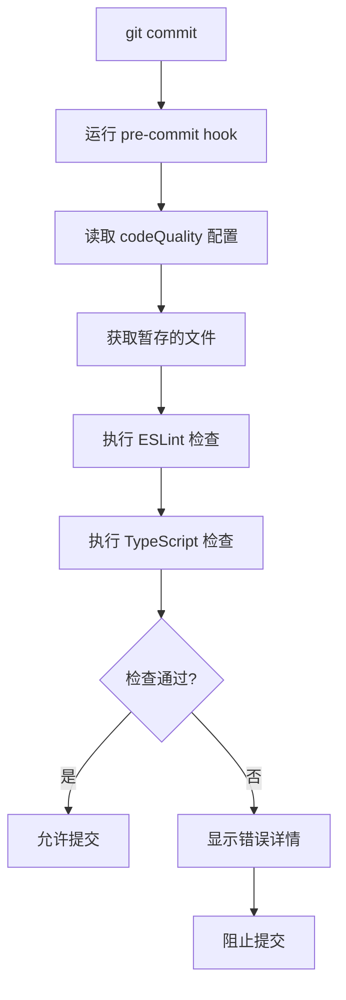

# 代码质量检查配置指南

## 📋 概述

项目已配置自动化的增量代码质量检查，在每次 `git commit` 时自动执行。

## ⚙️ 配置说明

在 `package.json` 中的 `codeQuality` 节可以配置检查规则：

```json
{
  "codeQuality": {
    "eslint": "all",      // ESLint 检查模式
    "typescript": true    // TypeScript 检查（始终开启）
  }
}
```

### ESLint 配置选项

| 值      | 说明 | 示例输出 |
|---------|------|----------|
| `"all"` | ✅ **默认** - 检查错误和警告 | `检查 ESLint 错误和警告...` |
| `"error"` | 只检查错误，忽略警告 | `检查 ESLint 错误...` |
| `"off"` | 跳过 ESLint 检查 | `ESLint 检查已跳过（配置: off）` |

### TypeScript 配置

- 始终开启，不可关闭
- 使用增量编译加速检查

## 🚀 实际效果

### 默认配置 (`"all"`)

```bash
git commit -m "提交代码"
```

```
━━━━━━━━━━━━━━━━━━━━━━━━━━━━━━━━
  增量代码质量检查
━━━━━━━━━━━━━━━━━━━━━━━━━━━━━━━━

📋 当前配置：
  • ESLint: all
  • TypeScript: true

💡 提示：只检查暂存区的变更文件，大幅提升性能

📁 需要检查的文件：
  - src/new-feature.ts

① 检查 ESLint 错误和警告...
src/new-feature.ts(5,10): warning: 'unusedVar' is assigned a value but never used
   ESLint: ✅ 通过

② 检查 TypeScript 类型...
   💾 使用增量编译缓存...
   TypeScript: ✅ 通过

━━━━━━━━━━━━━━━━━━━━━━━━━━━━━━━━
✅ 增量检查通过！代码质量良好 ✨
```

### 宽松配置 (`"error"`)

```json
{
  "codeQuality": {
    "eslint": "error"
  }
}
```

只检查真正的错误，忽略小问题如未使用变量、命名规范等。

### 极简配置 (`"off"`)

```json
{
  "codeQuality": {
    "eslint": "off"
  }
}
```

完全跳过 ESLint，只保留 TypeScript 类型检查。

## 🔧 自定义配置

### 团队协作建议

**默认团队项目：**
```json
"codeQuality": {
  "eslint": "all",
  "typescript": true
}
```

**遗留项目或快速迭代：**
```json
"codeQuality": {
  "eslint": "error",
  "typescript": true
}
```

**纯类型检查项目：**
```json
"codeQuality": {
  "eslint": "off",
  "typescript": true
}
```

## ⚡ 性能优化

### ESLint 优化
- ✅ 只检查暂存的文件（使用 `git diff --cached`）
- ✅ 自动缓存已检查文件
- ✅ 支持自动修复（`--fix`）

### TypeScript 优化
- ✅ 增量编译（`tsBuildInfoFile`）
- ✅ 只重新编译变更影响的部分
- ✅ 缓存编译结果

### 性能对比

```
小型项目 (50 个文件):
  - 全量检查: ~3-5 秒
  - 增量检查: ~0.5-1 秒 (5-10 倍快)

大型项目 (500 个文件):
  - 全量检查: ~30-60 秒
  - 增量检查: ~1-3 秒 (20-60 倍快)
```

## 🚫 跳过检查（紧急情况）

如果需要跳过检查强制提交：

```bash
git commit -m "紧急修复" --no-verify
```

⚠️ **注意：建议仅在紧急情况下使用**

## 📊 检查流程



## 🛠️ 手动运行检查

```bash
# 运行增量检查脚本
./scripts/incremental-check.sh

# 运行完整检查（检查所有文件）
pnpm check
```

## 📝 注意事项

1. **配置文件位置**: 配置在 `package.json` 根级别
2. **语法**: 使用标准 JSON 格式，不支持注释
3. **默认值**: 如果 `package.json` 不存在，使用 `all` 和 `true`
4. **TypeScript**: 始终开启，无法关闭
5. **团队协作**: 配置会随代码自动同步给所有成员

## ❓ 常见问题

**Q: 如何在 CI/CD 中启用检查？**
A: CI/CD 中可以直接运行 `./scripts/incremental-check.sh`

**Q: 支持自定义 ESLint 规则吗？**
A: 支持，在 `eslint.config.js` 中配置

**Q: 如何查看缓存大小？**
A: `ls -lh .eslintcache`

**Q: 如何清除缓存？**
A: `rm .eslintcache`
